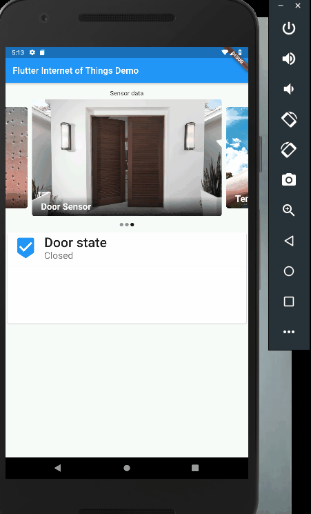
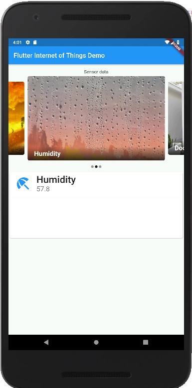
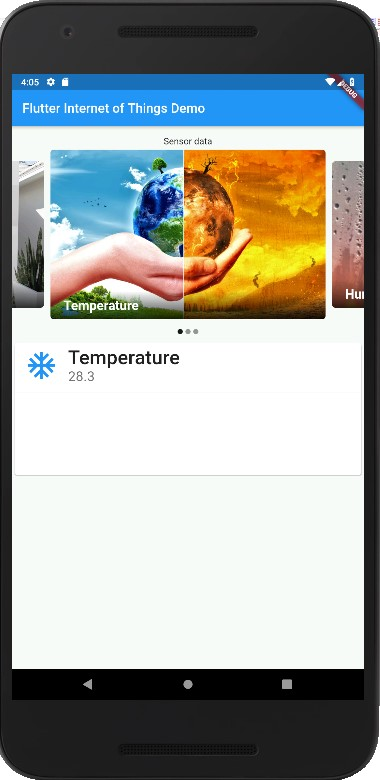
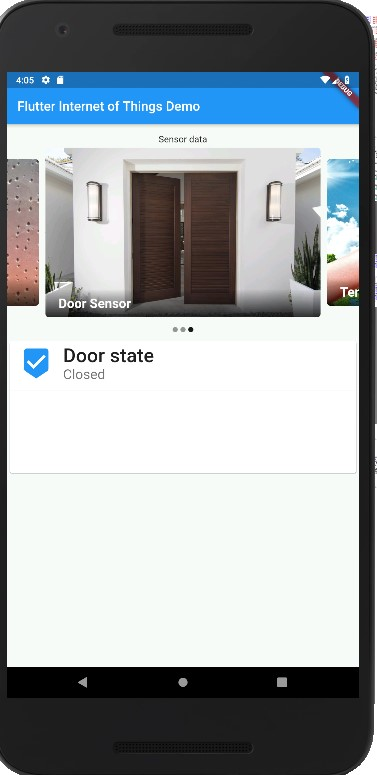

# Flutter Internet of Things Demo









This project demonstrate how flutter mobile app integrates with the Blynk Iot Platform.
Monitor the following sensory data:-
- Temperature
- Humidity
- Door State
- Movement/Motion

Future work will be using supervised machine learning classification algorithms to detect human pressence in the room.

https://github.com/armut/Occupancy-Detection

## Getting Started

This project is a starting point for a Flutter application.

A few resources to get you started if this is your first Flutter project:

- [Lab: Write your first Flutter app](https://flutter.dev/docs/get-started/codelab)
- [Cookbook: Useful Flutter samples](https://flutter.dev/docs/cookbook)

For help getting started with Flutter, view our 
[online documentation](https://flutter.dev/docs), which offers tutorials, 
samples, guidance on mobile development, and a full API reference.

# Arduino ESP32 Firmware

## First Arduino Sketch consist of the following sensory data
 * Room's temperature
 * Room's humidity
 * Room's door state

firmware/Xiaomi_ESP32_Blynk/Xiaomi_ESP32_Blynk.ino

```
#define BLYNK_PRINT Serial

#include <WiFi.h>
#include <WiFiClient.h>
#include <BlynkSimpleEsp32.h>
//#include <EEPROM.h>
#include "BLEDevice.h"
#include "soc/soc.h"
#include "soc/rtc_cntl_reg.h"

String receivedTemperatureValue = "";
String receivedHumidityValue = "";
#define uS_TO_S_FACTOR 1000000  //Conversion factor for micro seconds to seconds
#define TIME_TO_SLEEP  20       //Time ESP32 will go to sleep (in seconds)
RTC_DATA_ATTR int bootCount = 0;

static BLEAddress *addressOfOurThermometer;
BLERemoteService* remoteServiceOfTheThermometer;
static BLERemoteCharacteristic* characteristicOfTheTemperatureMeasurementValue;
BLERemoteDescriptor* descriptorForStartingAndEndingNotificationsFromCharacteristic;
BLEClient*  thisOurMicrocontrollerAsClient;
unsigned long startTime PROGMEM ;
const int doorSensor = 4;
const int greenLED = 2;

// You should get Auth Token in the Blynk App.
// Go to the Project Settings (nut icon).
char auth[] = "xxx";

// Your WiFi credentials.
// Set password to "" for open networks.
char ssid[] = "xxx";
char pass[] = "xxxx";

BlynkTimer timer;

class theEventsThatWeAreInterestedInDuringScanning: public BLEAdvertisedDeviceCallbacks {                    
  void onResult(BLEAdvertisedDevice advertisedDevice) {                                                      
    if (advertisedDevice.getName() == "MJ_HT_V1") {                                                          
      advertisedDevice.getScan()->stop();                                                                    
      addressOfOurThermometer = new BLEAddress(advertisedDevice.getAddress()); } } };                        

static void notifyAsEachTemperatureValueIsReceived(BLERemoteCharacteristic* pBLERemoteCharacteristic, uint8_t* receivedNotification, size_t length, bool isNotify) { 
                                                                                                                 
  for (int i=2; i<=5; i++) {
    receivedTemperatureValue += (char)*(receivedNotification+i); 
  }

  for (int i=9; i<=12; i++) {
    receivedHumidityValue += (char)*(receivedNotification+i); 
  }
  Serial.println(receivedTemperatureValue);
  Serial.println(receivedHumidityValue);
  delay(3000);
  if (receivedTemperatureValue.length() < 0 && receivedHumidityValue.length() < 0) return;

  int doorstate = digitalRead(doorSensor);
  if(doorstate == 1){
    Blynk.virtualWrite(V2, "Open");
    Serial.println("Open");
    digitalWrite(greenLED,HIGH);
  }else{
    Blynk.virtualWrite(V2, "Closed");
    Serial.println("Closed");
    digitalWrite(greenLED,LOW);
  }
  delay(2000);
  Blynk.virtualWrite(V0, receivedTemperatureValue);
  Blynk.virtualWrite(V1, receivedHumidityValue);
  Serial.println("Disconnect from BLE device.");
  thisOurMicrocontrollerAsClient->disconnect();
  hibernate();
} 

void hibernate() {
  esp_sleep_enable_timer_wakeup(TIME_TO_SLEEP * uS_TO_S_FACTOR);
  Serial.println("Setup ESP32 to sleep for every " + String(TIME_TO_SLEEP) +
  " Seconds");
  Serial.println("Going to sleep now.");
  Serial.flush();
  delay(1000);
  esp_deep_sleep_start();
}

void readTempHumidity() {
  if (thisOurMicrocontrollerAsClient->isConnected() == false) {
    thisOurMicrocontrollerAsClient->disconnect(); 
    delay(20); 
    thisOurMicrocontrollerAsClient->connect(*addressOfOurThermometer); 
    startTime = millis(); 
  } // Here the our ESP32 as a client asks for a connection to the desired target device.
  
  if( thisOurMicrocontrollerAsClient->isConnected() == false ) {
    Serial.println(F("e4 Connection couln't be established"));
  }
  
  if (remoteServiceOfTheThermometer == nullptr) { 
    remoteServiceOfTheThermometer = thisOurMicrocontrollerAsClient->getService("226c0000-6476-4566-7562-66734470666d"); 
  }                                            
  
  if (remoteServiceOfTheThermometer == nullptr) {
    thisOurMicrocontrollerAsClient->disconnect(); 
  }                  
  
  if (characteristicOfTheTemperatureMeasurementValue == nullptr) { 
    characteristicOfTheTemperatureMeasurementValue = remoteServiceOfTheThermometer->getCharacteristic("226caa55-6476-4566-7562-66734470666d"); 
  }    
  
  if (characteristicOfTheTemperatureMeasurementValue == nullptr) {
    thisOurMicrocontrollerAsClient->disconnect(); 
  } 

  if(characteristicOfTheTemperatureMeasurementValue != nullptr){
    characteristicOfTheTemperatureMeasurementValue->registerForNotify(notifyAsEachTemperatureValueIsReceived); 
  }
  
  if (descriptorForStartingAndEndingNotificationsFromCharacteristic == nullptr) { 
    descriptorForStartingAndEndingNotificationsFromCharacteristic = characteristicOfTheTemperatureMeasurementValue->getDescriptor(BLEUUID((uint16_t)0x2902));
  }                                                                                 
  
  if (descriptorForStartingAndEndingNotificationsFromCharacteristic == nullptr) {
    thisOurMicrocontrollerAsClient->disconnect(); 
  } 
  
  uint8_t startNotifications[2] = {0x01,0x00}; 
  if(descriptorForStartingAndEndingNotificationsFromCharacteristic != nullptr){
    descriptorForStartingAndEndingNotificationsFromCharacteristic->writeValue(startNotifications, 2, false);      
  }
                                                                                                                                                                  // Ideas: https://stackoverflow.com/questions/1269568/how-to-pass-a-constant-array-literal-to-a-function-that-takes-a-pointer-without
  startTime = millis(); 
  while( ( (millis() - startTime) < 5000) && (receivedTemperatureValue.length() < 4) )
  { 
    if (thisOurMicrocontrollerAsClient->isConnected() == false) {
    } 
  }
  
  characteristicOfTheTemperatureMeasurementValue->registerForNotify(NULL);
  uint8_t endNotifications[2] = {0x00,0x00}; 
  descriptorForStartingAndEndingNotificationsFromCharacteristic->writeValue(endNotifications, 2, false);
  
  if (receivedTemperatureValue.length() < 4) Serial.println(F("e14 No proper temperature measurement value catched."));
  thisOurMicrocontrollerAsClient->disconnect();
}

void setup() {
  Serial.begin(115200);
  WRITE_PERI_REG(RTC_CNTL_BROWN_OUT_REG, 0);
  Serial.setDebugOutput(0);
  pinMode(doorSensor, INPUT);
  pinMode(greenLED, OUTPUT);
  BLEDevice::init("esp32tempsensor");
  BLEScan* myBLEScanner = BLEDevice::getScan();
  myBLEScanner->setAdvertisedDeviceCallbacks(new theEventsThatWeAreInterestedInDuringScanning());
  myBLEScanner->setActiveScan(true);
  while (addressOfOurThermometer == nullptr) {
    myBLEScanner->start(30); startTime=millis();
    while ( (millis()-startTime <50) && (addressOfOurThermometer == nullptr) ) { delay(1); } }
  thisOurMicrocontrollerAsClient = BLEDevice::createClient();
  digitalWrite(greenLED,LOW);
  Blynk.begin(auth, ssid, pass);
  Blynk.syncAll();
  timer.setInterval(1000L, readTempHumidity);
  timer.setInterval(30*1000, reconnectBlynk); //run every 30s
}

void reconnectBlynk() {
  if (!Blynk.connected()) {
    Serial.println("Lost connection");
    if(Blynk.connect()) {
      Serial.println("Reconnected");
    }
    else {
      Serial.println("Not reconnected");
    }
  }
}

void loop() {
  if (Blynk.connected()) {  // If connected run as normal
    Blynk.run();
  }
  timer.run(); 
}

```
## Second Arduino Sketch consist of the following sensory data
 * Human/living life form movment

 firmware/MotionDetector/MotionDetector.ino

 ```
#include <WiFi.h>
#include <HTTPClient.h>
const int motionSensor PROGMEM = 12;

const char* ssid = "xxx";
const char* password = "xxx";
WiFiClient espClient;

void invokeRequest(String value){
  HTTPClient http;
  http.begin(value); //Specify the URL
  int httpCode = http.GET();                                        //Make the request

  if (httpCode > 0) { //Check for the returning code

      String payload = http.getString();
      Serial.println(httpCode);
      Serial.println(payload);
    }

  else {
    Serial.println("Error on HTTP request");
    ESP.restart();
  }

  http.end(); //Free the resources
  
}
void turnONLight(){
  invokeRequest("http://blynk-cloud.com/85a4ddf0b61149149fdffx2506590484c/update/V1?value=255"); //v1 to 255
  delay(50);
  invokeRequest("http://blynk-cloud.com/85a4ddf0b61149149fdfxf2506590484c/update/V2?value=255"); //v2 to 255
  delay(50);
  invokeRequest("http://blynk-cloud.com/85a4ddf0b61149149fdxff2506590484c/update/V3?value=255"); //v3 to 255
  delay(50);
  invokeRequest("http://blynk-cloud.com/238dc3bbbcfc4ed39a97c2x12d51f313a/update/V3?value=1"); //v3 to 1
  delay(50);
}

void offLight(){
  invokeRequest("http://blynk-cloud.com/85a4ddf0b61149149fxdff2506590484c/update/V1?value=0"); //v1 to 0
  delay(50);
  invokeRequest("http://blynk-cloud.com/85a4ddf0b61149149fdfxf2506590484c/update/V2?value=0"); //v2 to 0
  delay(50);
  invokeRequest("http://blynk-cloud.com/85a4ddxf0b61149149fdff2506590484c/update/V3?value=0"); //v3 to 0
  delay(50);
  invokeRequest("http://blynk-cloud.com/238dc3bbbcfcx4ed39a97c212d51f313a/update/V3?value=0"); //v3 to 1
  delay(50);
}
void setup_wifi() {
  delay(10);
  // We start by connecting to a WiFi network
  Serial.println();
  Serial.print("Connecting to ");
  Serial.println(ssid);

  WiFi.begin(ssid, password);

  while (WiFi.status() != WL_CONNECTED) {
    delay(500);
    Serial.print(".");
  }

  Serial.println("");
  Serial.println("WiFi connected");
  Serial.println("IP address: ");
  Serial.println(WiFi.localIP());
}


void setup() {
  Serial.begin(115200);
  Serial.setDebugOutput(0);
  pinMode(motionSensor, INPUT);
  setup_wifi();
  printWifiStatus();
  offLight();
}

void loop() {
  int motion = digitalRead(motionSensor);
  Serial.println(motion);
  if(motion == 1){
    Serial.println("MOTION DETECTED!!!");
    Serial.println("LOSER !!!");
    turnONLight();
    delay(15000);
    offLight();
  }
  Serial.println("WINNER !!!");
  delay(2000);
}

void printWifiStatus() {
  // print the SSID of the network you're attached to:
  Serial.print("SSID: ");
  Serial.println(WiFi.SSID());

  // print your WiFi shield's IP address:
  IPAddress ip = WiFi.localIP();
  Serial.print("IP Address: ");
  Serial.println(ip);

  // print the received signal strength:
  long rssi = WiFi.RSSI();
  Serial.print("signal strength (RSSI):");
  Serial.print(rssi);
  Serial.println(" dBm");
}

 ```